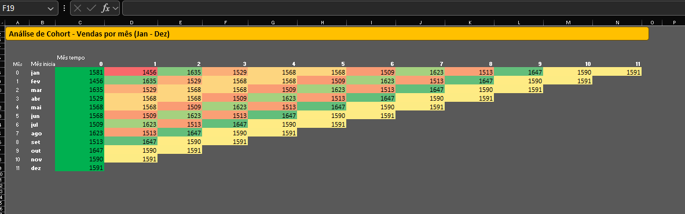
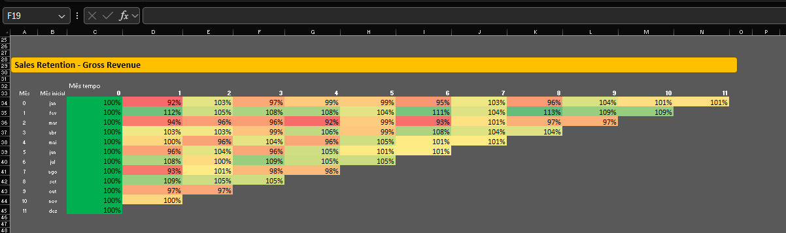
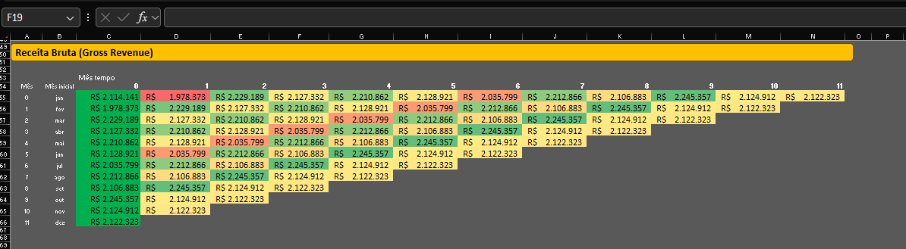
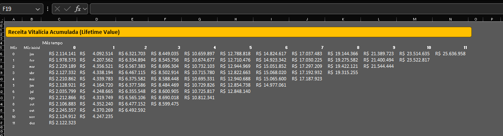
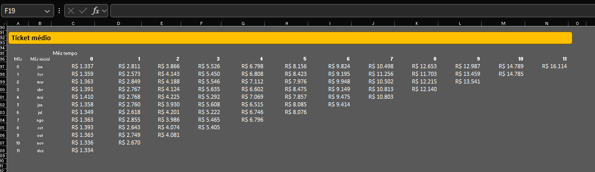

# Relatório em Excel 

## Análises

- Análise de Cohort
- Sales Retention
- Receita Bruta Mensal (Gross Revenue)
- Receita Vitalícia Acumulada (Life Time Value)
- Ticket Médio

## Objetivos

- Demonstrar meus conhecimentos técnicos em Excel por meio de análises de dados utlizando um dataset público.

- Construir e monitorar as principais métricas do negócio por meio de análises descritivas.

## Análise de Cohort

## Sales Retention

## Receita Bruta (Gross Revenue)

## Receita Vitalícia Acumulada (Life Time Value - LTV)

## Tícket Médio!

## Arquivo completo 
Link: <a href="https://bit.ly/4f1mJFO" target="_blank">Arquivo Completo em Excel</a>

## Status do Projeto
- Em andamento